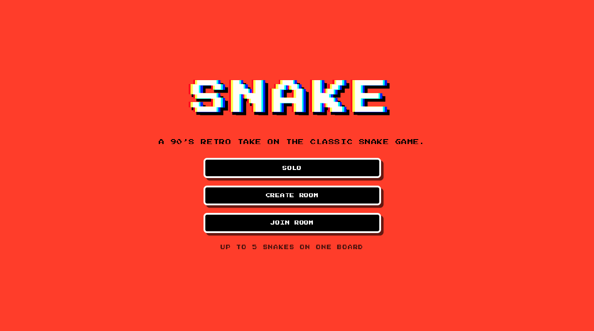

# Snake Game — retro ’90s style

Here's the [Game's Website](https://snake-game.ylx-studio.com/)



Server-authoritative snake, solo or five at a time. Every rule lives in the
Python backend, which also runs the clock; the browser draws the state it is
sent and forwards key presses, and holds no game logic of its own.

## Highlights

- **Solo**: one snake on 48x27, with a leaderboard the server writes itself
- **Group**: up to five snakes on a shared 64x36 board, joined by a six-character room code, one clock, last one standing
- A spotlight on the head: the board fades to near black eight cells out, and in a room an opponent past five cells is not drawn at all
- Full-bleed canvas letterboxed to 16:9 at any window size, cycling palettes on a solo run and fixed white in a room
- **A mascot on the menu that watches your cursor**, blinks, gets bored after five seconds and loses its temper when you tap it — written as **maths, not a motion library**. There is no animation package in `package.json`: the gaze is exponential easing, `1 - e^(-rate·dt)`, which composes, so it runs at one speed on a 30Hz screen and a 144Hz one; the shake is a sine wave under a half-sine envelope, so the body leaves and returns to rest with no jump at either end; the blink is a triangle that lands back on exactly 1. `web/lib/menuCreature.ts` is pure functions with no React and no DOM in it, so every pose is unit tested without a browser.

## Built with

- [Python](https://www.python.org/) 3.11+, [FastAPI](https://fastapi.tiangolo.com/), [uvicorn](https://www.uvicorn.org/)
- [pytest](https://docs.pytest.org/), SQLite from the standard library locally, and
  [Psycopg](https://www.psycopg.org/) 3 over PostgreSQL for deployed persistence
- [Next.js](https://nextjs.org/) 16 App Router, [React](https://react.dev/) 19
- [TypeScript](https://www.typescriptlang.org/), Canvas 2D, hand-written CSS
- Deployed on [Vercel](https://vercel.com/) (front end) and
  [Render](https://render.com/) (game server), with the leaderboard on
  [Supabase](https://supabase.com/) PostgreSQL

## Local Development

Both servers must run. Use two terminals.

Backend — Python 3.11+, five pinned dependencies:

```bash
cd backend
python3 -m venv .venv
.venv/bin/pip install -r requirements.txt
./dev.sh                  # ws://127.0.0.1:8000/ws
```

`./dev.sh` is `uvicorn --reload`. `PORT=9000 ./dev.sh` moves it;
`.venv/bin/python main.py` runs it without reload.

Front end — Node 20+:

```bash
cd web
npm install
npm run dev               # http://127.0.0.1:3000
npm run typecheck         # tsc --noEmit
npm run lint
npm run build && npm start
```

The game server binds **loopback only**: use `127.0.0.1`, not `localhost` — on
macOS `localhost` may resolve to `::1` first and fail.

## Configuration

**Front end.** `web/.env.local`, copied from `web/.env.local.example`:

```text
NEXT_PUBLIC_WS_URL=ws://127.0.0.1:8000/ws
```

Without it the client falls back to the same address.

**Back end.** One variable, `DATABASE_URL`, from `backend/.env.example`:

```text
sqlite:///./leaderboard.db    a local file — the default, created on first run
sqlite:///:memory:            nothing survives the process
postgresql://user@host/db     a deployed PostgreSQL database
```

- Rooms are not configured because rooms are not stored: they live in memory and
  are worth nothing once everyone leaves.
- The leaderboard is the only durable state, behind a `LeaderboardRepository`
  Protocol (`backend/leaderboard/repository.py`); `repository_from_env()`
  selects SQLite or PostgreSQL from the URL scheme.
- SQLite remains the zero-setup local default. Deployments set `DATABASE_URL`
  to a secret PostgreSQL connection string; unsupported schemes fail at startup
  instead of silently writing to an ephemeral container file.

## Playing

### Solo

| | |
| --- | --- |
| Board | 48x27 |
| Start | the first arrow key; the snake waits in the middle until then |
| Steer | arrows or WASD |
| Keys | Space pauses and resumes, R resets |
| Apple | +1 length, +1 score, and the screen flips to the next of eight palettes |
| Light | one cell of full brightness, then a seven-cell fade to 90% dark |
| Whole board | READY, PAUSED and GAME_OVER — the dark is the difficulty, so it lights only play |

Leaderboard:

- The **server** writes the score. No client message carries one.
- One row per player, holding their best; ties go to whoever got there first.
- 100 rows stored, ten shown on the menu.
- A run that ate nothing is not recorded, and the card says so.
- A name in the visible top ten is reserved against everyone, the holder included.

### Group

| | |
| --- | --- |
| Players | 2–5 |
| Code | six characters, upper case, no `O` `0` `I` `1` |
| Host | the first one in; only the host can start |
| Start | a synchronised `3 · 2 · 1`, every snake at once |
| Board | 64x36, white, with a black frame for the walls |
| Apples | 2 for two players, 3 for three, 4 for four or five |
| Light | as solo, plus: an opponent past five cells is not drawn at all |
| Telling snakes apart | a name tag on your own head, and a numbered roster in the corner |

Death:

| | |
| --- | --- |
| Wall, or your own body | you die |
| Another snake's body | you die; they do not |
| Two heads into the same cell | everyone in that cell dies |
| Two snakes swapping places | both die |

- An apple is worth 1. There are no kill points.
- Death clears your body; you watch on, and your keys stop counting.
- The round ends when one snake is left.
- Ranking is survival first, score second; a shared place consumes the slots behind it: 1, 1, 3.
- **Room scores never reach the solo leaderboard.**
- The fog is **appearance, not enforcement**: the server sends every position to
  everybody, so it hides opponents from the player, not from the browser. A dead
  player watches with the light off.

## Tests

The rules are tested on the Python side, with no browser:

```bash
cd backend
.venv/bin/pytest
.venv/bin/pytest -m multiplayer      # one marker group
.venv/bin/pytest -k "absent food"
```

Every case carries a marker mirroring its file:

```text
snake        the body, growth, and the turn buffer
collision    wall and self collision
game         the tick, food, score and status
wire         the serialized shape the browser receives
command      parsing and applying client messages
multiplayer  several snakes on one board, resolved in lockstep
room         codes, lobbies, the host, and the room lifecycle
leaderboard  the solo high-score store
protocol     the full client/server contract, over a real socket
```

`protocol` is the only slow group: real WebSockets and a shortened countdown.

The front end is checked rather than unit tested, apart from the arithmetic with
no React in it — the board fit, the player colours, the fog's radii and falloff:

```bash
cd web
npm test        # node --test over web/test/*.test.mjs
```

## The Wire Contract

One set of messages, written twice, with no schema or codegen between them.
**Change one, change the other in the same commit.**

```text
backend/protocol.py          every message, in and out
backend/game/game.py         Game.to_dict()               -> "state"
backend/game/multiplayer.py  MultiplayerGame.to_dict()    -> "game_state"
backend/room/room.py         lobby_state() / results()
web/types/game.ts            ServerMessage / ClientMessage
```

Solo keeps `"state"` and a room sends `"game_state"`: one snake and one apple is
a different shape from five snakes, a list of apples and a roster.
`docs/protocol.md` is the full reference — every message, limit, error code and
the room lifecycle.

A turn is a round trip; the browser draws nothing until the server answers:

```text
          player presses W
                  ↓
  web/lib/input.ts             the key's position -> a ClientMessage
                  ↓
  web/lib/websocket.ts         send({ type: "turn", direction: "UP" })
                  ↓
  ─ ─ ─ ─ ─ ─ ─ ─ ─ ─ ─ ─ ─ ─ ─ ─ ─ ─  ws://127.0.0.1:8000/ws
                  ↓
  backend/main.py              the receive loop
                  ↓
  backend/protocol.py          parse() -> Turn(UP)
                  ↓
  backend/connection.py        routed to the solo game or to the room
                  ↓
  Game.turn / GameRoom.turn    buffered; the committed heading is untouched
                  ↓
  tick()                       the next tick is what actually moves anything
                  ↓
  to_dict()                    {"type": "state" | "game_state", ...}
                  ↓
  ─ ─ ─ ─ ─ ─ ─ ─ ─ ─ ─ ─ ─ ─ ─ ─ ─ ─   (a room's tick goes to everyone in it)
                  ↓
  hooks/useGameSession.ts      server messages reduced into React state
                  ↓
  components/game/GameCanvas.tsx
                  ↓
  lib/renderer.ts              repaints the board it was handed
```

Three things bend that rule, all appearance rather than rules:

- **Colour** — the server sends `palette`, an index; the hex pairs live in
  `web/lib/palette.ts`, so a hue can be retuned without restarting the backend.
- **Board size** — the grid is the server's, the browser only decides how large
  to draw it, so resizing scales the game by one factor and can never end a run.
- **The fog** — `web/lib/vision.ts` decides what is drawn and how bright, out of
  state the server sent in full.

## Project Structure

```text
.
├── backend/                    # Python game server
│   ├── main.py                 # FastAPI wiring: /ws, /health, the janitor
│   ├── connection.py           # one player's session: menu, solo or a room
│   ├── protocol.py             # every message, in and out. No side effects.
│   ├── transport.py            # the socket end of a player's outbox
│   ├── dev.sh                  # uvicorn --reload on 127.0.0.1
│   ├── pyproject.toml          # where the pytest markers are registered
│   ├── requirements.txt        # five pinned dependencies
│   ├── .env.example            # DATABASE_URL
│   ├── game/                   # rules. No sockets, no asyncio, no rooms.
│   │   ├── game.py             # solo: the tick, food, score, status, palette
│   │   ├── multiplayer.py      # several snakes on one board, in lockstep
│   │   ├── spawns.py           # a symmetric start per player count
│   │   ├── snake.py            # body, heading, turn buffering, growth
│   │   ├── collision.py        # pure wall and self-collision predicates
│   │   └── command.py          # the solo commands, as values
│   ├── room/                   # who is playing together. Synchronous.
│   │   ├── room.py             # GameRoom: roster, host, lifecycle
│   │   ├── manager.py          # create, find, join, leave, sweep
│   │   ├── clock.py            # one task per round - the only async part
│   │   ├── session.py          # PlayerSession: id, nickname, outbox
│   │   ├── codes.py            # six characters, no look-alikes
│   │   └── nickname.py         # validation
│   ├── leaderboard/
│   │   └── repository.py       # the Protocol, SQLite/PostgreSQL stores, and URL factory
│   └── tests/                  # pytest, one file per marker group
├── web/                        # Next.js front end
│   ├── app/
│   │   ├── page.tsx            # the stage, and which screen is on it
│   │   ├── layout.tsx          # the pixel font
│   │   ├── icon.svg            # the favicon the mascot is drawn from
│   │   └── globals.css         # the stage and the screens, sized in cells
│   ├── components/
│   │   ├── game/               # the canvas, the readouts, the name tag
│   │   ├── screens/            # loading, menu, lobby, round, results
│   │   └── ui/                 # the panel, the mascot, the fields
│   ├── hooks/
│   │   ├── useGameSession.ts   # the only React <-> socket seam
│   │   ├── useBoardRect.ts     # measures the window
│   │   └── useMenuPop.ts       # the menu colour index, advanced by the mascot
│   ├── lib/                    # no React imported anywhere below here
│   │   ├── websocket.ts        # the WebSocket client
│   │   ├── input.ts            # keys -> commands, by key position
│   │   ├── renderer.ts         # canvas drawing, stateless per frame
│   │   ├── snakeEnds.ts        # which corners of a head or tail round
│   │   ├── vision.ts           # the spotlight, and what is drawn at all
│   │   ├── palette.ts          # the colour pairs, and the player colours
│   │   ├── playout.ts          # one frame a beat, so jitter is not the timing
│   │   ├── netstats.ts         # the gaps between arrivals and paints
│   │   ├── menuCreature.ts     # the mascot's maths: gaze, blink, shake, face
│   │   ├── nickname.ts         # the same rule as the server, run early
│   │   └── board.ts            # where the board sits, and how big
│   ├── test/                   # node --test over the lib maths, no browser
│   ├── types/game.ts           # the wire contract, client side
│   ├── .env.local.example      # NEXT_PUBLIC_WS_URL
│   └── next.config.ts          # dev origins and dev indicators
├── docs/protocol.md            # every message, limit and error code
├── CLAUDE.md                   # working notes on the load-bearing details
├── education.md                # a teaching guide to this code, in Chinese
└── LICENSE                     # MIT
```


## Privacy

No email, no password, no account, no OAuth. A nickname is a one-off label,
remembered in `localStorage` only so the box comes back filled in. The server
stores nicknames and scores for finished solo runs, and nothing else.

## Rights

© 2026 YLX. Released under the [MIT License](LICENSE): use it, change it, ship
it, sell it — commercially or not — as long as the copyright notice and the
licence text travel with the copy. It comes with no warranty.
